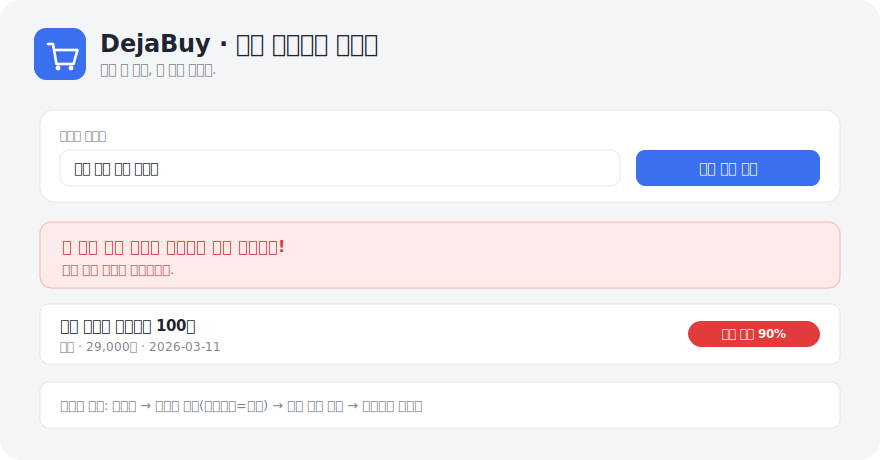

<div align="center">

# 🛒 DejaBuy — 쿠팡 중복구매 방지기

**이미 산 물건, 또 사지 마세요.**
묶음 구매하다 중복 구매하는 걸 막아주는, 한국어 유사도 엔진 기반 로컬 웹앱.

*A local web app that warns you before you re-buy something you already own — powered by a Korean-aware similarity engine.*

[](LICENSE)




</div>

---

## 🧩 문제 (Why)

쿠팡에서 묶음으로 장을 보다 보면, **이미 집에 있는 물건을 또 사는 일**이 반복됩니다.
"와이셔츠"를 이미 샀는데 "정장 셔츠"라는 이름으로 또 담는 식이죠.
이름이 조금만 달라도 사람은 눈치채기 어렵습니다. → **그걸 대신 잡아주는 도구**를 만들었습니다.

## ✨ 기능 (Features)

- **구매 전 확인** — 사려는 제품명을 넣으면 과거 구매와 비교해 🔴거의 동일 / 🟡유사 / ✅없음 을 즉시 판정
- **똑똑한 유사도 매칭** — 브랜드·용량·색상 같은 노이즈를 걷어내고, `와이셔츠 = 셔츠 = 남방` 같은 표현 차이까지 흡수
- **쿠팡 주문내역 가져오기** — 주문목록 화면을 복사·붙여넣으면 상품명/가격/날짜를 파싱해 일괄 등록
- **사용자 정의 카테고리** — 원하는 카테고리를 직접 만들어 관리
- **모바일 대응(PWA)** — 아이폰 "홈 화면에 추가" 시 전체화면 앱처럼 실행

## 🧠 핵심: 유사도 엔진은 어떻게 동작하나 (How it works)

이 프로젝트의 기술적 핵심은 [`matcher.py`](matcher.py)의 유사도 엔진입니다. 외부 AI 의존성 없이 표준 라이브러리만으로 동작하고, 원하면 임베딩 모델을 얹어 의미 매칭까지 확장됩니다.

```
입력: "남성 정장 셔츠 네이비"   vs   기존: "무지 화이트 와이셔츠 100수"
  │
  ├─ ① 정규화     용량/수량/색상/마케팅 문구 제거  →  "남성 정장 셔츠"  vs  "무지 셔츠"
  ├─ ② 동의어 사전  와이셔츠·셔츠·남방·정장셔츠 → 같은 그룹으로 통일
  ├─ ③ 다중 신호   문자순서 · 2-gram · 3-gram · 단어겹침 · 포함관계 를 조합
  ├─ ④ 카테고리 가산점  같은 카테고리면 +0.10
  └─ (선택) ⑤ 의미 유사도  ko-sroberta 임베딩이 있으면 사전에 없는 관계까지 포착
        │
        ▼
     유사도 0.90  →  "🔴 거의 동일"  경고
```

- **0.85 이상** → 거의 동일(빨강), **0.60 이상** → 유사(노랑). 임계값은 [`matcher.py`](matcher.py)에서 조절 가능.
- 동의어/노이즈 사전을 넓힐수록 정확도가 올라가는 **투명하고 디버깅 가능한** 설계.

## 🛠 기술 스택 (Tech Stack)

| 영역 | 사용 |
|------|------|
| 백엔드 | Python 3.10, Flask 3 |
| 저장소 | SQLite (표준 라이브러리 `sqlite3`) |
| 유사도 | `difflib` + 직접 구현한 정규화·동의어·n-gram 엔진, (선택) `sentence-transformers` |
| 프런트 | 서버 사이드 렌더링(Jinja2) + 바닐라 JS + PWA |

## 🚀 실행 방법 (Run locally)

```bash
pip install -r requirements.txt
python app.py
# 브라우저에서 http://127.0.0.1:5000
```

첫 실행 시 감을 잡을 수 있게 예시 구매 4건이 자동으로 들어갑니다.
아이폰 등 다른 기기 접속 및 클라우드 배포는 [DEPLOY.md](DEPLOY.md) 참고.

## 📁 프로젝트 구조

```
app.py               Flask 라우팅 (구매확인 / 추가 / 가져오기 / 카테고리)
matcher.py           유사도 엔진  ← 이 프로젝트의 핵심
coupang_import.py    주문내역 텍스트 파서
db.py                SQLite 데이터 계층 (자동 생성)
templates/           화면 (index / import_preview)
static/              PWA manifest · 아이콘
```

## 🗺 로드맵 (Roadmap)

- [ ] 쿠팡 상품 페이지용 브라우저 확장 — 페이지에서 바로 "이미 있음" 배지
- [ ] 카테고리별 지출 요약 / 통계
- [ ] 다국어(영문) 상품명 지원 강화
- [ ] 임베딩 유사도 기본 내장(경량 모델)

## 📄 라이선스

[MIT](LICENSE) © 2026 kimmykimmim
